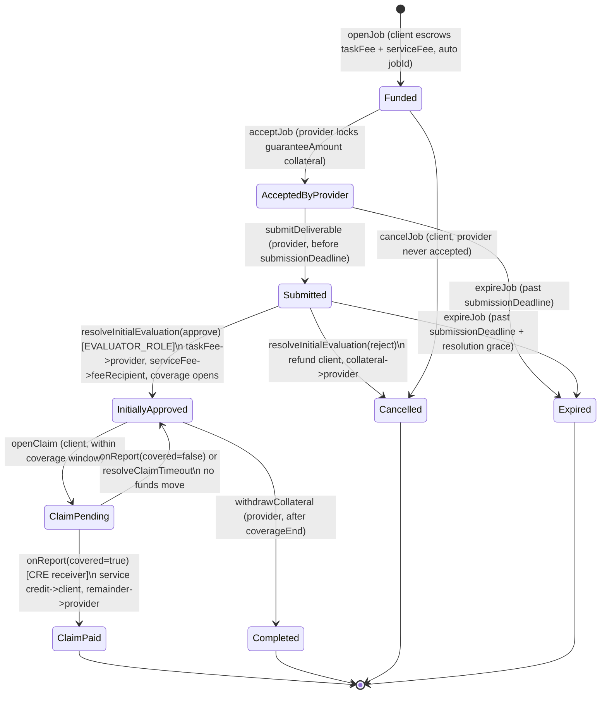
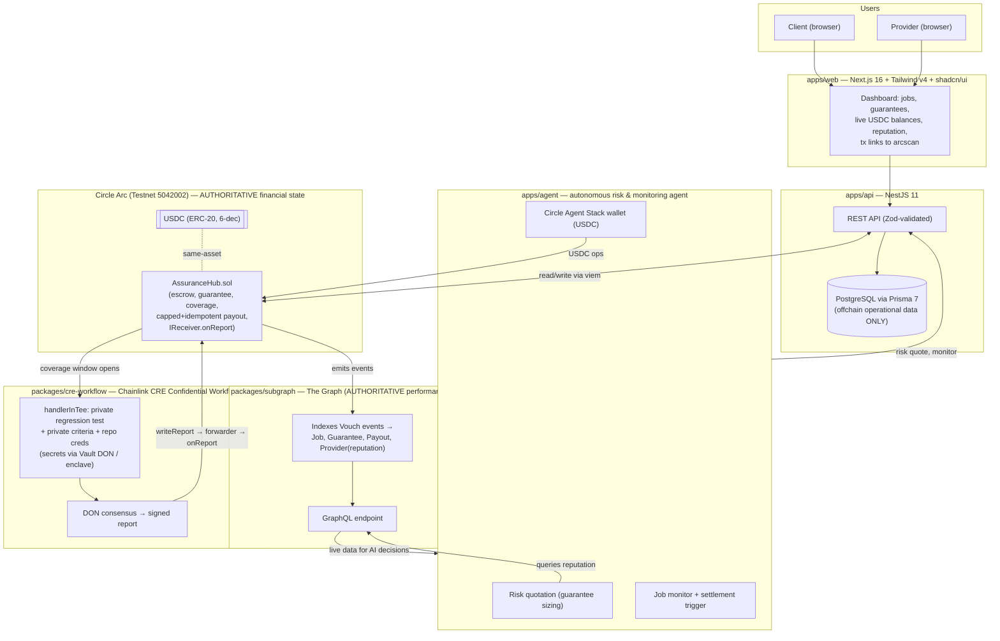

# Vouch — Confidential Outcome-Assurance Protocol

Vouch lets an AI-coding provider post a **capped, self-funded performance guarantee** that a
**confidential regression test** can trigger *after* the job is paid — turning point-in-time
acceptance into durable, onchain-priced accountability.

---

## Live proof (Arc testnet)

| | |
|---|---|
| **Deployed app** | [`https://withvouch.xyz`](https://withvouch.xyz) *(deploying)* — API `https://api.withvouch.xyz`, agent `https://agent.withvouch.xyz` |
| **Review in one command** | `docker compose up` — boots the stack and serves the dashboard + `/health` against the live Arc deployment (browse + read-live; click-through mutation needs a funded browser wallet + SIWE). |
| **Network** | Circle **Arc testnet**, chain id **`5042002`** (`eip155:5042002`) · explorer [`testnet.arcscan.app`](https://testnet.arcscan.app) |
| **`AssuranceHub`** (settlement) | [`0xB30e054557533f28753B4ACdf646B393E2072bf9`](https://testnet.arcscan.app/address/0xB30e054557533f28753B4ACdf646B393E2072bf9) · deploy [`0x72c92d8d…`](https://testnet.arcscan.app/tx/0x72c92d8d18e3248982ad0f811b40c1c6f69c70c8b0e0f6d4a5f534e51d0bb9cc) |
| **`QuoteBondEscrow`** (agent bond) | [`0x3ca2d854d5f042dd0ddd39eaf80644be0e80048c`](https://testnet.arcscan.app/address/0x3ca2d854d5f042dd0ddd39eaf80644be0e80048c) · deploy [`0x3a7cad0c…`](https://testnet.arcscan.app/tx/0x3a7cad0c974d82c23bfee9f997cf601fce411058a21736557bd5c3afa7d87ecf) |

The full end-to-end lifecycle — covered claim, no-claim, and a real autonomous agent bond — is
**proven with live transactions** (see the [evidence table](#sponsor-integrations--evidence) and
[live coordinates](#live-coordinates-arc-testnet)).

---

## The problem

Acceptance tests are a **point-in-time** signal. An AI coding change can pass the public test suite,
be accepted, and be paid for — then be revealed as defective by a regression that only a **private**
or **later-run** test detects. Once the fee is released, the client has no recourse and the provider
bears no consequence.

**Ordinary escrow does not close this gap.** Escrow releases funds *on acceptance* and then the
relationship is over — it has no notion of a window after payment during which a fault can still be
proven, and it cannot adjudicate a failure that only a *confidential* test can see (revealing the
test would destroy its value). Vouch's novelty is exactly that missing piece: a **post-acceptance
coverage window** plus a **confidential trigger**.

---

## The solution

A **provider voluntarily** attaches a **provider-funded, capped performance guarantee** to a job.
After the task fee is paid on public-test acceptance, a **coverage window** opens during which a
**confidential regression test running in a Chainlink CRE TEE** can prove a covered failure and
trigger a **capped service-credit payout** to the client. The verdict becomes **onchain
reputation**, indexed by The Graph, so the provider's next quote prices in its own track record.

Vouch is **not** a marketplace, **not** general insurance (no pools, no third-party premiums), and
**not** ordinary escrow. It integrates exactly three sponsor tracks and nothing else.

### Canonical 6-step flow

1. **Client funds** a 20-USDC coding job — `openJob` escrows `taskFee + serviceFee`.
2. **Provider locks** capped guarantee collateral — `acceptJob`.
3. **Public tests pass** → evaluator approves → the **20-USDC task fee releases** and a **24-hour
   coverage window opens** (`resolveInitialEvaluation` → `CoverageStarted`).
4. A **confidential regression test runs inside the CRE TEE** during coverage.
5. A **covered failure is proven** → capped guarantee paid to the client (`onReport` →
   `GuaranteePaid`).
6. The **verdict is indexed by The Graph** → provider reputation updates → the next quote prices it
   in.

---

## Sponsor integrations → evidence

Exactly three tracks. Every row links to a live transaction, endpoint, or committed file.

| Track | What Vouch does | Verifiable evidence |
|---|---|---|
| **The Graph** — Best AI Tooling / AI Use Case (From Scratch), $5,000 | `packages/subgraph` (net-new: 13 entities, 13 handlers) indexes `AssuranceHub` into provider reputation. The agent's risk quote in `apps/agent/src/graph/client.ts` (`getProviderRisk`) is a **pure function of indexed data** — no onchain aggregate, no DB mirror, no fixture (ADR-003), and fail-closed if the index is stale/lagging/unavailable. | Studio endpoint [`api.studio.thegraph.com/query/1760065/vouch/v0.0.2`](https://api.studio.thegraph.com/query/1760065/vouch/v0.0.2) · CID `QmaoAwseMjoD3EMFwhQf3KBqqyac7sa4anpUBxK7iwEM8p` · reputation loop: upheld claim indexed → `lastUpheldClaimRateBps` 10000→5000 → next quote `premiumBps 2000` (`UPHELD_CLAIM_RISK`). 12 Matchstick tests + `packages/subgraph/scripts/health-check.mjs`. |
| **Arc / Circle Agent Stack** — Best Agentic Economy App, $3,500 (+$2,500 conditional on mainnet) | Foundry contracts live on chain `5042002`; a policy-bound Circle **developer-controlled wallet** (`apps/agent/src/wallet/agentWallet.ts`, contract-execution-only, per-tx/daily caps + destination allowlist) autonomously posts and refunds a reputation-priced quote-bond. | Real agent bond `escrow.postBond` [`0x5d9d1af8…`](https://testnet.arcscan.app/tx/0x5d9d1af8a0516fbf588e9962bcc4928c40a088e820d15707c2be10adfded040a) · refund [`0xd668c466…`](https://testnet.arcscan.app/tx/0xd668c466666465d5db9360218c220c9cbc76f212961946ab51a0ea5404909fd4) · agent wallet [`0x482e0a53…`](https://testnet.arcscan.app/address/0x482e0a53d97b0a9be1045f58cdbf9d244bd303be). Honest nuance: the agent is **transport**, never settles the guarantee principal (disclosed no-op, `apps/agent/src/index.ts:67-71`). |
| **Chainlink CRE** — Best Confidential Workflow, $2,000 | `packages/cre-workflow` runs the private regression test inside a real `handlerInTee<…>` (`@chainlink/cre-sdk@1.20.1`, `workflow.ts:213-224`, Nitro constraint `us-west-2`). Repo token, pass-threshold, and private test stay inside the enclave; only the 7-tuple verdict is declassified → `writeReport` → `AssuranceHub.onReport` → capped `min(amount, guaranteeAmount)`. | Live `cre workflow simulate` (CLI v1.33.0) → **`REPORTED:PAYOUT`** in [`docs/evidence/simulate-cli-payout.txt`](docs/evidence/simulate-cli-payout.txt) + 5 deterministic harness files + sha256 `MANIFEST`. Simulate is **explicitly accepted evidence** (official rule) — Confidential Workflows are private beta. Covered-claim onchain payout also demonstrated: jobId 1 `GuaranteePaid` → `ClaimPaid` [`0x9659db91…`](https://testnet.arcscan.app/tx/0x9659db91e1ca8c8781cd44a21fa61719c23ade64605641c704e533e41a400bce). |

---

## Live coordinates (Arc testnet)

Full public record: [`docs/DEPLOYMENT.md`](docs/DEPLOYMENT.md).

| Coordinate | Value |
|---|---|
| Chain id | `5042002` (`eip155:5042002`) |
| Explorer | [`https://testnet.arcscan.app`](https://testnet.arcscan.app) |
| `AssuranceHub` | [`0xB30e054557533f28753B4ACdf646B393E2072bf9`](https://testnet.arcscan.app/address/0xB30e054557533f28753B4ACdf646B393E2072bf9) |
| `QuoteBondEscrow` | [`0x3ca2d854d5f042dd0ddd39eaf80644be0e80048c`](https://testnet.arcscan.app/address/0x3ca2d854d5f042dd0ddd39eaf80644be0e80048c) |
| USDC (official Arc predeploy) | [`0x3600000000000000000000000000000000000000`](https://testnet.arcscan.app/address/0x3600000000000000000000000000000000000000) |
| Agent Circle wallet (SCA) | [`0x482e0a53d97b0a9be1045f58cdbf9d244bd303be`](https://testnet.arcscan.app/address/0x482e0a53d97b0a9be1045f58cdbf9d244bd303be) |
| Subgraph query endpoint | [`https://api.studio.thegraph.com/query/1760065/vouch/v0.0.2`](https://api.studio.thegraph.com/query/1760065/vouch/v0.0.2) |
| Deploy block / subgraph `startBlock` | `61747921` |
| CRE identity | `workflowId = keccak256("vouch-assurance-v1")`, `workflowName = "vouchclaim"` |

> USDC on Arc is a 6-decimal ERC-20 view of the 18-decimal native gas asset — the **same funds**,
> never two balances.

### Live lifecycle transactions

| Scenario | Result | Tx |
|---|---|---|
| Covered claim (jobId 1) | client received the 2-USDC guarantee, `GuaranteePaid` → `ClaimPaid` | [`0x9659db91…`](https://testnet.arcscan.app/tx/0x9659db91e1ca8c8781cd44a21fa61719c23ade64605641c704e533e41a400bce) |
| No-claim (jobId 3) | coverage expired, `withdrawCollateral` → `Completed`, 0.5-USDC collateral returned | [`0x0edec39d…`](https://testnet.arcscan.app/tx/0x0edec39dc4748cbcbd03fe0cd78c9c124ff0ecaf4374241a1a5d06ef8022a66a) |
| Real agent bond | policy-capped Circle wallet → `escrow.postBond` (1 USDC) | [`0x5d9d1af8…`](https://testnet.arcscan.app/tx/0x5d9d1af8a0516fbf588e9962bcc4928c40a088e820d15707c2be10adfded040a) |
| Bond refund | `refundBond` → escrow 1→0, agent wallet restored | [`0xd668c466…`](https://testnet.arcscan.app/tx/0xd668c466666465d5db9360218c220c9cbc76f212961946ab51a0ea5404909fd4) |

---

## Architecture

Full treatment (state machine, data flow, ADRs): [`docs/architecture.md`](docs/architecture.md).
Exported diagram: [`docs/diagrams/architecture.png`](docs/diagrams/architecture.png).

### Protocol state machine



### Component / data flow



### Authority model (condensed)

Full detail in [`docs/architecture.md`](docs/architecture.md) §3 and [`docs/security.md`](docs/security.md).

| Concern | Authoritative store | Notes |
|---|---|---|
| Escrow, service fee, guarantee collateral, payouts | Arc `AssuranceHub` | Capped, idempotent, receiver-gated payout |
| Provider reputation / performance history | The Graph subgraph | Derived from minimal onchain events; no onchain aggregate |
| UI cache, orchestration metadata, sessions | Postgres / Prisma | **Operational only** — rebuildable, never money/reputation |
| Private tests, criteria, repo credentials | CRE TEE (Vault DON) | Confidential from node operators; only a verdict leaves |

`AssuranceHub` composes `ReceiverBase, AccessControl, Pausable, ReentrancyGuard`. Authority is split
across three surfaces: **`DEFAULT_ADMIN_ROLE`** (config/role only — timelocked forwarder/workflow
changes, `pause`, `setFeeRecipient`; **can never seize principal**, machine-checked by
`test_NoAdminCanSeizeFunds`), **`EVALUATOR_ROLE`** (public approve/reject only), and the **CRE
receiver** (`onReport` — the only claim-finalizing path, gated by forwarder + packed workflow
identity). Pausable pauses **entries, never exits**, so no rightful funds are ever trapped.

---

## Security & trust model

> ### Trust model & what's simulated
> These are **deliberate design boundaries** for a testnet submission — stated up front, not
> discovered in Q&A. Full treatment: [`docs/security.md`](docs/security.md).
>
> - **Testnet settlement is a trusted-relay path, not trust-minimized.** Arc testnet exposes no
>   canonical KeystoneForwarder, so `onReport` authorizes on `msg.sender == forwarder` + workflow
>   identity — there is **no on-chain DON-signature verification yet**. Whoever holds the forwarder
>   key could forge a `covered=true` report (bounded by `amount ≤ guaranteeAmount` + recipient
>   binding). This is **agent-as-transport**, not attested settlement.
> - **Simulate ≠ attested.** The CRE `simulate` PAYOUT is a single local node — proof the workflow
>   logic and gating work end-to-end, **not** proof of on-chain delivery or a Nitro attestation.
>   The TEE guarantees **confidentiality of inputs**, not attested integrity of the output.
> - **The agent is transport, never authority.** It quotes and posts operational bonds
>   autonomously, but it **never moves guarantee principal** and can never forge a valid settlement.
> - **The Graph is queried via Subgraph Studio**, a centralized dev endpoint (3,000 queries/day) —
>   not the decentralized network. This qualifies under the official rule (Studio + API key), and it
>   is the freshness-gated, load-bearing reputation source, but it is not a decentralized indexer.
>
> **Mainnet roadmap** closes each of these: an attested-DON forwarder path, on-chain signature
> verification, and a decentralized-network subgraph.

**The money-safety part is strong and tested:** payout is capped (`min(amount, guaranteeAmount)`),
settlement is idempotent (`settled`/`claimFiled` latches → replayed reports are no-ops), reports are
domain-bound (`chainId + hub`), the solvency invariant `usdc.balanceOf(hub) ≥ totalLiabilities`
holds at every state (fuzzed + exact-conservation tested), and the API only marks a tx final after
`confirmations ≥ 3` **and** an arg-hash + expected-event match.

---

## Technology stack

- **Contracts:** Solidity + **Foundry** (`AssuranceHub`, `QuoteBondEscrow`) on Circle **Arc**.
- **Indexing:** **The Graph** (subgraph, AssemblyScript handlers, Matchstick tests) via Subgraph Studio.
- **Confidential compute:** **Chainlink CRE** Confidential Workflow, `@chainlink/cre-sdk@1.20.1`
  (`handlerInTee`, Nitro TEE, Vault DON secrets).
- **Web:** **Next.js 16** + Tailwind v4 + shadcn/ui.
- **API:** **NestJS 11**, Zod-validated, CORS-scoped, ThrottlerGuard, fail-closed env.
- **Agent:** **Fastify** + Circle **developer-controlled wallets** + an MCP server
  (`apps/agent/src/server/mcp.ts`).
- **Data:** **Prisma 7** / PostgreSQL (offchain operational only). **viem** for chain I/O.
- **Monorepo:** **pnpm** + **Turborepo**.

### Monorepo layout

| Path | Package | Responsibility |
|---|---|---|
| `apps/web` | `@vouch/web` | Next.js 16 dashboard: jobs, guarantees, live USDC balances, reputation, tx links. |
| `apps/api` | `@vouch/api` | NestJS 11 REST API. **Offchain operational data only.** |
| `apps/agent` | `@vouch/agent` | Fastify autonomous risk-quotation + job-monitoring agent + MCP server. **Never settles guarantee funds.** |
| `packages/contracts` | `@vouch/contracts` | Foundry contracts on Arc — authoritative financial state. |
| `packages/subgraph` | `@vouch/subgraph` | The Graph subgraph (from scratch) — authoritative reputation history. |
| `packages/cre-workflow` | `@vouch/cre-workflow` | Chainlink CRE Confidential Workflow (TEE). The **only** place private tests/criteria/creds live. |
| `packages/shared` | `@vouch/shared` | Zod schemas, types, chain constants, ABIs, logger, errors. |
| `packages/config` | `@vouch/config` | Shared TS / ESLint / Prettier config. |
| `packages/ui` | `@vouch/ui` | shadcn/ui primitives shared across apps. |
| `packages/db` | `@vouch/db` | Prisma 7 client. Offchain operational data only — never money/reputation/secrets. |

---

## Local setup

Requires **Node 22** (see `.nvmrc`) and **pnpm**; contracts additionally require **Foundry**
(`forge`).

```bash
pnpm install

# copy env templates (no real values ship in the repo)
cp .env.example .env
cp .env.development.example .env.development
# per-environment templates: .env.arc-testnet.example, .env.arc-mainnet.example
```

**One-command review:** `docker compose up` boots the stack and serves the dashboard + `/health`
against the live Arc deployment (browse + read-live). Click-through mutation additionally needs a
funded browser wallet + SIWE sign-in.

---

## Test commands

| Script | Action |
|---|---|
| `pnpm dev` | Run all apps in dev (`turbo run dev`). |
| `pnpm build` | Build all packages/apps. |
| `pnpm lint` | Lint the workspace. |
| `pnpm typecheck` | Strict TypeScript typecheck. |
| `pnpm test` | Run unit tests. |
| `pnpm test:contracts` | Foundry contract tests (`forge test` in `packages/contracts`). |
| `pnpm test:e2e` | End-to-end tests. |
| `pnpm gate:secrets` | Secret-leak gate (fails closed; also runs the CRE harness as a positive control). |
| `pnpm demo:health` | Live health check against the deployment. |

---

## What was built during the hackathon

- **`AssuranceHub` + `QuoteBondEscrow`** deployed live to Arc testnet with the full lifecycle
  (escrow, capped/idempotent payout, coverage window, receiver-gated settlement) proven by real txs.
- **The Graph subgraph from scratch** (13 entities, 13 handlers, 12 Matchstick tests) deployed to
  Subgraph Studio, driving a **pure-function risk quote** that is fail-closed on stale data.
- **Circle Agent Stack wallet** posting and refunding a real reputation-priced quote-bond
  autonomously, with policy caps + allowlist.
- **Chainlink CRE Confidential Workflow** with a real `handlerInTee`, enclave secrets, and a live
  `cre workflow simulate` producing `REPORTED:PAYOUT` — plus a deterministic harness and sha256
  manifest.
- **End-to-end reputation loop:** an upheld claim indexed by The Graph raised the provider's risk
  and made the next agent quote measurably more expensive — proven on live data.
- Web dashboard, NestJS API, and the fail-closed security posture (confirmation discipline, secret
  gate, timelocked admin).

---

## Limitations

Stated plainly; each is a design boundary, not a surprise (see [`docs/security.md`](docs/security.md) §3, §6).

- **Trusted-relay settlement on testnet** — no on-chain DON-signature verification yet (see trust box).
- **CRE live enclave deploy needs private-beta enrollment** — `simulate` is the accepted evidence today.
- **The agent never auto-posts the guarantee bond** — `JobCreated` carries no `quoteId`; the
  autonomous onchain action is the operational quote-bond only.
- **Reputation exists only as indexed Graph data** — no onchain aggregate; a consumer pointed at a
  stale/wrong subgraph reads wrong history (freshness gate mitigates).
- **Partial credit is reserved / integration-dead** — the live CRE path always emits
  `amount == guaranteeAmount`.
- **Arc mainnet is config + checklist only** — no real-value deploy without written authorization;
  the mainnet USDC predeploy is not yet published, so it is not hardcoded.

---

## Future roadmap

- **Attested-DON settlement path** on Arc mainnet: canonical forwarder + **on-chain DON-signature
  verification**, removing the trusted-relay assumption.
- **Nitro attestation checked on-chain** before a verdict is trusted (input *and* output integrity).
- **Decentralized-network subgraph** beyond the Studio dev endpoint.
- **Arc mainnet deployment** (chain `5042` — goes live Sept 16, 2026) once USDC predeploy is
  published and authorization is granted.
- Broader verticals beyond AI coding for the confidential post-acceptance coverage primitive.

---

## License

MIT — see [`LICENSE`](LICENSE).
