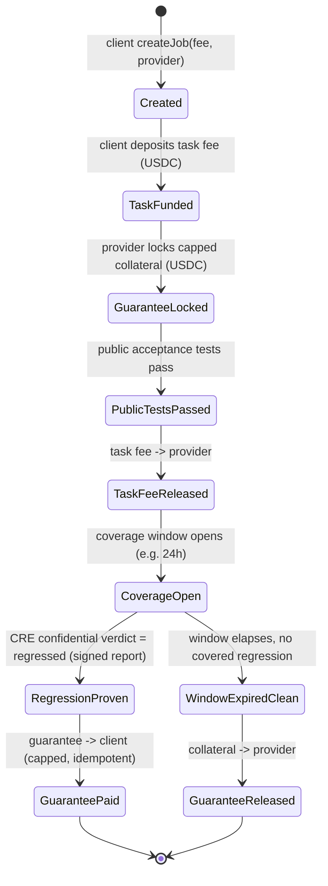
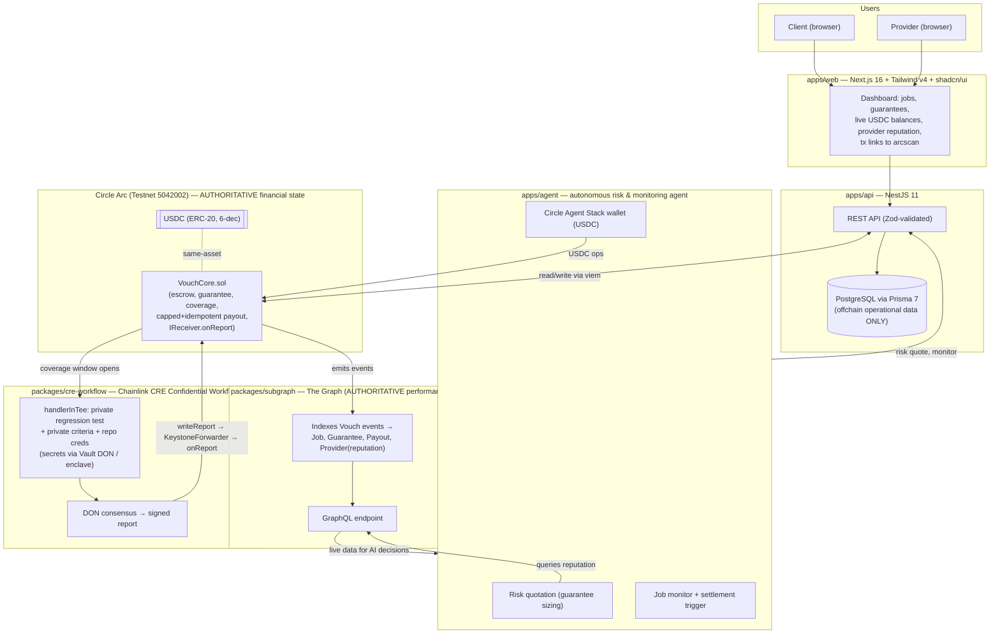

# Vouch — Architecture

This document captures the system architecture: the protocol **state machine**, the
**component / data-flow diagram**, the **authority model**, and a summary of the key **design
decisions** (full ADRs live in [`docs/decisions/`](decisions/)).

---

## 1. Protocol state machine

Happy-path lifecycle:

`Created → TaskFunded → GuaranteeLocked → PublicTestsPassed → TaskFeeReleased → CoverageOpen →
(RegressionProven → GuaranteePaid) | (WindowExpiredClean → GuaranteeReleased)`

The contract design must additionally handle the edge cases enumerated in the plan (E1–E11, plus
E8b and the invariants in §17.6): public-test failure, missing collateral, window expiry, a
verdict arriving after the window closes, double-payout / replayed report (idempotency), payout
exceeding locked collateral (cap), mid-window withdrawal attempts, unauthorized callers,
inconclusive tests, USDC decimal confusion, and reentrancy. See `packages/contracts` for the
test suite covering these.

---

## 2. Component / data-flow diagram

> **CRE TypeScript note (correction per plan §17.2):** the diagram labels the confidential step
> `handlerInTee` for readability, but the **TypeScript** CRE SDK has **no** `handlerInTee` /
> `TeeRuntime` / `usingTheDons`. In TypeScript, confidentiality is delivered by
> **`ConfidentialHTTPClient`** (the request + secret injection run inside the enclave) within a
> normal `handler`. Only the **Go** SDK exposes `cre.HandlerInTee`. See
> [`docs/prize-requirements.md`](prize-requirements.md) and
> [`docs/decisions/002-confidential-verification-cre.md`](decisions/002-confidential-verification-cre.md).

---

## 3. Authority model

This is the non-negotiable architectural constraint that governs where every piece of state lives.

- **Contracts → ABIs → `packages/shared`** are consumed by `web`, `api`, `agent`, `cre-workflow`,
  and `subgraph`. Contracts are the single source of truth for ABIs.
- **Authoritative money / reputation:**
  - **Arc contracts (`VouchCore`)** hold all financial *state*: escrowed task fees, locked
    guarantee collateral, capped + idempotent payouts.
  - **The Graph** holds all performance / reputation *history*, derived by indexing Arc events.
- **Operational / rebuildable:** **PostgreSQL via Prisma** stores only offchain operational data
  (UI cache, orchestration metadata, notification state, non-authoritative mirrors). It is
  **never** the source of truth for money or reputation and can be rebuilt from onchain + subgraph
  data.
- **Confidential:** private tests, private evaluation criteria, and repository credentials live
  **only** inside the CRE **TEE** — provisioned via the Vault DON at runtime, or `.env` for local
  simulation. Secrets never touch Postgres, public onchain metadata, the subgraph, or IPFS.
  Onchain, only **hashes / commitments / verdicts** are committed — never criteria or test
  contents.

| Concern | Authoritative store | Notes |
|---|---|---|
| Escrow, guarantee collateral, payouts | Arc `VouchCore` contract | Capped, idempotent, DON-gated payout. |
| Provider reputation / performance history | The Graph subgraph | Derived from minimal onchain events. |
| UI cache, orchestration metadata, notifications | Postgres / Prisma | Operational only; rebuildable; never money/reputation. |
| Private tests, criteria, repo credentials | CRE TEE (Vault DON) | Never in Postgres, onchain metadata, subgraph, or IPFS. |

---

## 4. Design decisions

Summaries below; each links to its full ADR (Context / Decision / Consequences).

### ADR-001 — Arc owns all financial state
A single settlement chain avoids cross-chain financial reconciliation. USDC-as-native-gas plus
full EVM compatibility make Foundry and viem first-class, and The Graph indexes Arc events as the
reputation source of truth. See
[`decisions/001-settlement-chain.md`](decisions/001-settlement-chain.md).

### ADR-002 — Confidential verification via CRE TEE, not a plain server
Private regression tests and evaluation criteria must be provably secret from node operators. A
plain API server cannot offer that guarantee; a Chainlink CRE Confidential Workflow runs the
verification inside a **TEE** with secrets released by the **Vault DON** directly into the enclave.
See [`decisions/002-confidential-verification-cre.md`](decisions/002-confidential-verification-cre.md).

### ADR-003 — Reputation derived in the subgraph
Contracts emit **minimal** events; The Graph aggregates provider performance (jobs completed,
guarantees locked, regressions, total paid out). This keeps gas low and makes The Graph
load-bearing rather than a passive mirror. See
[`decisions/003-reputation-in-subgraph.md`](decisions/003-reputation-in-subgraph.md).

### ADR-004 — Payout authority = onchain DON-signature verification
**Revised per plan §17.3.** Real money moves **only** on a **DON-signed report** whose signature
is **verified onchain** — not on trust of `msg.sender`. This distinguishes **agent-as-transport**
(allowed: an agent may relay the signed report bytes) from **agent-as-authority** (forbidden: the
agent can never forge a valid DON signature and so can never unilaterally settle). The receiver is
also bound to the **expected workflow id / owner** so a different workflow on the same forwarder
cannot settle Vouch jobs.

Open question: whether Arc testnet exposes a canonical **KeystoneForwarder** (use
`ReceiverTemplate` forwarder-gating) or whether Vouch must deploy a **minimal onchain signature
verifier** and let an untrusted relay deliver the bytes. See
[`decisions/004-payout-authority-forwarder.md`](decisions/004-payout-authority-forwarder.md).
