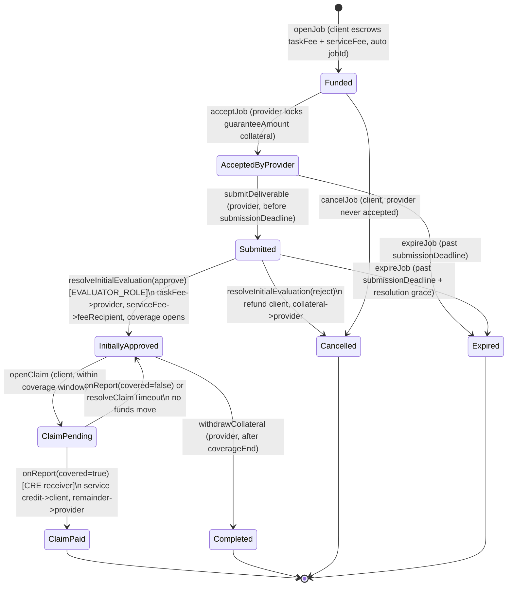

# Vouch — Architecture

This document captures the system architecture: the protocol **state machine**, the
**component / data-flow diagram**, the **authority model**, and a summary of the key **design
decisions** (full ADRs live in [`docs/decisions/`](decisions/)).

---

## 1. Protocol state machine

The `AssuranceHub` settlement contract implements the `AssuranceJob` lifecycle. Amounts are
6-decimal USDC base units; only salted **commitments** (`bytes32`) are stored for private material,
never preimages.

Happy-path lifecycle:

`Funded → AcceptedByProvider → Submitted → InitiallyApproved → (ClaimPending → ClaimPaid) | Completed`

with `Cancelled` / `Expired` as refund exits. There is **no** separate `Created` state: a single
`openJob` merges job creation and client funding into one transaction (emitting `JobCreated` then
`JobFunded`).

`State` enum (per plan §19 D2): `None, Funded, AcceptedByProvider, Submitted, InitiallyApproved,
ClaimPending, ClaimPaid, Completed, Cancelled, Expired`.

**Canonical events.** All downstream consumers (subgraph, shared ABI, agent) bind to these exact
signatures — the 12 canonical lifecycle events plus `ServiceFeePaid`:

| Event | Emitted when |
|---|---|
| `JobCreated` | `openJob` — record created (fires with `JobFunded` in the same tx) |
| `JobFunded` | `openJob` — client escrows `taskFee + serviceFee` |
| `ProviderAccepted` | `acceptJob` — provider locks the guarantee collateral |
| `DeliverableSubmitted` | `submitDeliverable` — provider posts the submission commitment |
| `InitialEvaluationResolved` | `resolveInitialEvaluation` — evaluator approves/rejects |
| `CoverageStarted` | approval — `coverageEnd` stamped, coverage window opens |
| `ClaimOpened` | `openClaim` — client opens a claim within coverage |
| `ConfidentialEvaluationResolved` | `onReport` / `resolveClaimTimeout` — confidential verdict |
| `GuaranteePaid` | covered claim — capped service credit paid to client |
| `CollateralReleased` | provider collateral returned (clean completion or covered remainder) |
| `JobExpired` | `expireJob` — deadline missed, refund |
| `JobCancelled` | `cancelJob` / initial rejection — refund |
| `ServiceFeePaid` | approval — optional service fee routed to `feeRecipient` |

Event payloads carry only ids, amounts, addresses, booleans, and **commitments (hashes)** — never
criteria/evidence preimages or failure strings.

The contract additionally handles the edge cases enumerated in the plan: submission-deadline
expiry, initial rejection, a confidential verdict never arriving (`resolveClaimTimeout` returns
collateral to the provider — plan §19 D3 / BLOCKER B1), double-payout / replayed report
(idempotency via the `settled` + `claimFiled` latches), payout exceeding the guarantee (capped at
`min(amount, guaranteeAmount)`), mid-coverage withdrawal attempts, unauthorized callers, USDC
decimal confusion, and reentrancy. The solvency invariant `usdc.balanceOf(this) >=
totalLiabilities` holds at every state. See `packages/contracts` for the test suite covering these.

---

## 2. Component / data-flow diagram

> **CRE TypeScript note (updated 2026-09-12 — verified against the installed SDK):** the diagram's
> `handlerInTee` label is **literal**. `@chainlink/cre-sdk@1.20.1` **does** export `handlerInTee` +
> `TeeRuntime` (with `reportFromDon` / `usingTheDons`) — `packages/cre-workflow/workflow.ts:212`
> registers the confidential handler with a real `handlerInTee<…>` call and a TEE constraint
> (`[{ tee: "nitro", regions: ["us-west-2"] }]`; `us-west-2` is the only region the SDK accepts).
> Credentials are injected inside the enclave via `ConfidentialHTTPClient` `{{.token}}` templating
> (`vaultDonSecrets`); the private pass-threshold comes from `getSecret`. An **earlier** revision of
> this doc claimed the TS SDK lacked the symbol (true of pre-1.x betas / a Go-only reading) — that is
> stale; no Go rewrite is needed. Caveats: `confidential-http@1.0.0-alpha` is alpha, and response
> confidentiality (`encryptOutput`) is opt-in (default off) — see
> [`docs/decisions/002-confidential-verification-cre.md`](decisions/002-confidential-verification-cre.md)
> and [`docs/security.md`](security.md).

---

## 3. Authority model

This is the non-negotiable architectural constraint that governs where every piece of state lives.

- **Contracts → ABIs → `packages/shared`** are consumed by `web`, `api`, `agent`, `cre-workflow`,
  and `subgraph`. Contracts are the single source of truth for ABIs.
- **Authoritative money / reputation:**
  - **Arc contracts (`AssuranceHub`)** hold all financial *state*: escrowed task fees + optional
    service fees, locked guarantee collateral, capped + idempotent payouts.
  - **The Graph** holds all performance / reputation *history*, derived by indexing Arc events.
- **Operational / rebuildable:** **PostgreSQL via Prisma** stores only offchain operational data
  (UI cache, orchestration metadata, notification state, non-authoritative mirrors). It is
  **never** the source of truth for money or reputation and can be rebuilt from onchain + subgraph
  data.
- **Confidential:** private tests, private evaluation criteria, and repository credentials live
  **only** inside the CRE **TEE** — provisioned via the Vault DON at runtime, or `.env` for local
  simulation. Secrets never touch Postgres, public onchain metadata, the subgraph, or IPFS.
  Onchain, only **hashes / commitments / verdicts** are committed — never criteria or test
  contents.

### Onchain roles & trust surfaces (`AssuranceHub`)

`AssuranceHub` composes `ReceiverBase, AccessControl, Pausable, ReentrancyGuard` (it drops
`Ownable2Step`). Authority is split across two deliberately separated trust surfaces plus admin
config:

- **`DEFAULT_ADMIN_ROLE`** — config and role management only: `setForwarder`,
  `setExpectedWorkflow`, `setFeeRecipient`, `pause` / `unpause`. It can **never** redirect principal
  (task fee or collateral) to itself — every admin function is routing/config, machine-checked by
  `test_NoAdminCanSeizeFunds`. Hold in a multisig for production (deployer EOA for the hackathon).
- **`EVALUATOR_ROLE`** — the *public* trust surface: `resolveInitialEvaluation` only. It approves or
  rejects the public submission (off-chain judgement, on-chain call). It is a global role, not
  per-job. It cannot pay itself.
- **CRE receiver** (`ReceiverBase`) — the *confidential* trust surface and the **only** path that
  finalizes a claim and can trigger a guarantee payout (`onReport`). The receiver is gated by both
  the **forwarder** address and the **workflow identity** (packed Keystone metadata:
  `bytes32 workflowId | bytes10 workflowName | address workflowOwner`), so a different workflow on
  the same forwarder cannot settle Vouch jobs.

**Pausable pauses entries, never exits.** `whenNotPaused` guards liability-growing entries
(`openJob`, `acceptJob`, `submitDeliverable`, `resolveInitialEvaluation`). Fund **exits** are never
pausable — `withdrawCollateral`, `cancelJob`, `expireJob`, `resolveClaimTimeout`, and `onReport`
stay callable while paused so no party's rightful funds can be trapped. `unpause` is admin-only.

The **guarantee terms are negotiated off-chain** (from the agent's risk quote): `openJob` encodes
the agreed `guaranteeAmount`, and the provider's `acceptJob` locking exactly that amount **is** the
agreement (plan §19 D1). The optional **service fee** is separate protocol revenue routed to a
configurable `feeRecipient` at approval — it is never part of the escrowed principal.

| Concern | Authoritative store | Notes |
|---|---|---|
| Escrow, service fee, guarantee collateral, payouts | Arc `AssuranceHub` contract | Capped, idempotent, receiver-gated payout. |
| Provider reputation / performance history | The Graph subgraph | Derived from minimal onchain events. |
| UI cache, orchestration metadata, notifications | Postgres / Prisma | Operational only; rebuildable; never money/reputation. |
| Private tests, criteria, repo credentials | CRE TEE (Vault DON) | Never in Postgres, onchain metadata, subgraph, or IPFS. |

---

## 4. Design decisions

Summaries below; each links to its full ADR (Context / Decision / Consequences).

### ADR-001 — Arc owns all financial state
A single settlement chain avoids cross-chain financial reconciliation. USDC-as-native-gas plus
full EVM compatibility make Foundry and viem first-class, and The Graph indexes Arc events as the
reputation source of truth. See
[`decisions/001-settlement-chain.md`](decisions/001-settlement-chain.md).

### ADR-002 — Confidential verification via CRE TEE, not a plain server
Private regression tests and evaluation criteria must be provably secret from node operators. A
plain API server cannot offer that guarantee; a Chainlink CRE Confidential Workflow runs the
verification inside a **TEE** with secrets released by the **Vault DON** directly into the enclave.
See [`decisions/002-confidential-verification-cre.md`](decisions/002-confidential-verification-cre.md).

### ADR-003 — Reputation derived in the subgraph
Contracts emit **minimal** events; The Graph aggregates provider performance (jobs completed,
guarantees locked, regressions, total paid out). This keeps gas low and makes The Graph
load-bearing rather than a passive mirror. See
[`decisions/003-reputation-in-subgraph.md`](decisions/003-reputation-in-subgraph.md).

### ADR-004 — Payout authority = onchain DON-signature verification
**Revised per plan §17.3.** Real money moves **only** on a **DON-signed report** whose signature
is **verified onchain** — not on trust of `msg.sender`. This distinguishes **agent-as-transport**
(allowed: an agent may relay the signed report bytes) from **agent-as-authority** (forbidden: the
agent can never forge a valid DON signature and so can never unilaterally settle). The receiver is
also bound to the **expected workflow id / owner** so a different workflow on the same forwarder
cannot settle Vouch jobs.

Open question: whether Arc testnet exposes a canonical **KeystoneForwarder** (use
`ReceiverTemplate` forwarder-gating) or whether Vouch must deploy a **minimal onchain signature
verifier** and let an untrusted relay deliver the bytes. See
[`decisions/004-payout-authority-forwarder.md`](decisions/004-payout-authority-forwarder.md).
